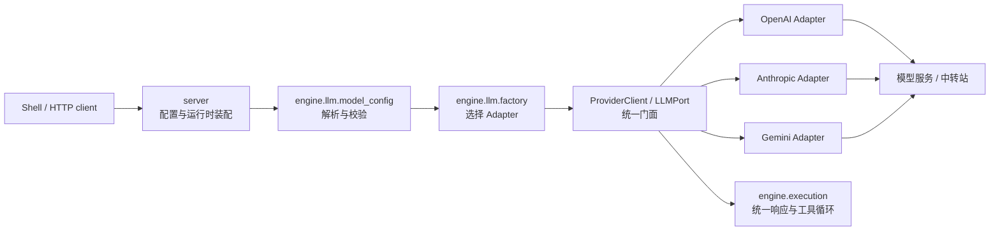
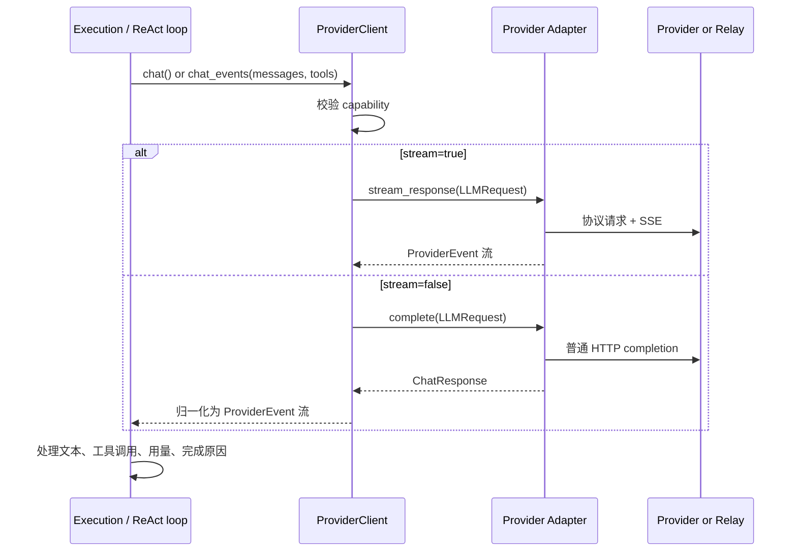

# 04b · LLM 模块设计与调用指南

本文描述 Agent-Smith 的 LLM 调用模块：它解决什么问题、如何配置和调用、请求如何流转、如何扩展协议，以及本地使用场景下的安全边界。

> 定位：这是一个本地优先、单用户使用的模型连接层。它允许用户接入可信的 HTTPS 模型供应商或中转站；它不是多租户模型网关，也不承担计费、配额或组织级密钥管理。

---

## 1. 设计目标

LLM 模块位于 `engine/llm/`，负责把上层的统一模型请求翻译为具体模型协议，再把响应还原为统一结果。核心目标是：

1. **协议隔离**：执行引擎不需要知道 OpenAI、Anthropic 或 Gemini 的请求/流式格式。
2. **稳定契约**：无论供应商如何返回，上层只处理 `ChatResponse`、`ProviderEvent` 与 `LLMPort`。
3. **配置分层**：可按交互、门禁、后台三类用途选择不同模型与超时策略。
4. **本地安全**：API Key 不通过读取接口、提示词或运行时元数据暴露；调用端点受到统一校验和流式资源限制。
5. **可扩展性**：新增协议只需新增 adapter 并在 registry 注册，不需要改执行引擎。

## 2. 模块边界与依赖方向



依赖严格保持为 `server → engine → common`：

- `server/` 保存配置、提供本地 API、创建运行时；不解释供应商响应格式。
- `engine/llm/` 拥有协议适配、统一契约与模型配置解析；不依赖 FastAPI。
- `engine/execution/` 只依赖 `LLMPort`，不导入任何具体 adapter。
- `shell/` 只通过 `/api/config/llm` 管理配置，不直接调用模型服务。

因此，LLM 层是独立的 engine 子模块；唯一允许了解具体 adapter 的地方是 `engine.llm.factory` 这个组合根。

## 3. 核心对象

| 对象 | 文件 | 职责 |
|---|---|---|
| `LLMPort` | `engine/llm/port.py` | 执行引擎使用的最小模型接口：`chat`、`chat_events`、`chat_stream`、`close` |
| `LLMRequest` / `ChatResponse` | `engine/llm/contracts.py` | 供应商无关的请求与完整响应数据 |
| `ProviderEvent` | `engine/llm/events.py` | 统一的流式事件：文本、思考、工具参数、用量、完成 |
| `ProviderAdapter` | `engine/llm/adapters/base.py` | 具体协议 adapter 的私有接口 |
| `ProviderClient` | `engine/llm/client.py` | adapter 外的统一门面、能力校验与非流式事件归一化 |
| `ProviderRegistry` | `engine/llm/factory.py` | provider 名称规范化、别名和 adapter 构造 |
| `model_config` | `engine/llm/model_config.py` | 多层配置合并、用途路由、超时和端点校验 |

## 4. Provider 与兼容协议

配置中要区分两个概念：

| 字段 | 含义 | 是否影响请求 |
|---|---|---|
| `vendor` | 供应商或中转站的展示名称，例如 `Sophnet` | 否；仅用于运行时身份展示 |
| `provider` | 兼容协议：`openai`、`anthropic`、`gemini` | 是；决定 adapter 和认证/请求格式 |
| `base_url` | 模型端点根地址 | 是 |
| `api_key` | 调用凭据 | 是 |
| `model` | 服务端模型 ID | 是 |

已支持的 adapter：

- `openai`：OpenAI Chat Completions 兼容协议；`openai_compatible` 是兼容别名。
- `anthropic`：原生 Messages API 与 `x-api-key` 认证。
- `gemini`：使用 Gemini 的 OpenAI-compatible endpoint；未提供端点时使用内置默认地址。

`vendor` 不会参与 adapter 构造、请求体、认证、路由选择或 LLM 客户端缓存键。它会被安全地裁剪为单行展示元数据，以便模型在被问到“当前由谁提供”时正确区分供应商和兼容协议。

## 5. 配置与用途路由

最小配置位于 `~/.agent-smith/config.yaml`：

```yaml
llm:
  vendor: Sophnet
  provider: openai
  api_key: ${YOUR_API_KEY}
  base_url: https://gateway.example.com/v1
  model: Hy3-preview
```

配置合并优先级从低到高为：环境变量 → 平台配置 → Smith seed 配置 → Smith runtime 配置 → 会话覆盖。环境变量支持 `AGENTSMITH_LLM_API_KEY`、`AGENTSMITH_LLM_BASE_URL`、`AGENTSMITH_LLM_MODEL` 与 `AGENTSMITH_LLM_PROVIDER`。

同一份配置可按用途覆盖：

```yaml
llm:
  provider: openai
  api_key: ${PRIMARY_KEY}
  base_url: https://gateway.example.com/v1
  model: primary-model
  routes:
    gate:
      model: fast-review-model
    background:
      model: economical-model
  timeout_profiles:
    interactive: { read: 90, stream_read: 120 }
    gate: { read: 45, stream_read: 90 }
    background: { read: 240, stream_read: 300 }
```

`interactive` 用于主对话，`gate` 用于质量门禁，`background` 用于后台任务。命名模型 profile 可以为某个会话选择另一套模型字段，而不改变全局默认。

### 端点约束

模型端点会在 API 保存和最终 client 构建两个入口重复校验：必须是带 hostname 的 `https://` URL，不能携带 URL 凭据、query 或 fragment，也不能使用字面量私网、回环或链路本地 IP。这样即使手工修改 YAML 或通过环境变量设置，最终构建时也不会绕过校验。

这意味着本地明文 HTTP relay 不在默认支持范围内。若未来确有开发需求，应新增显式、受限的开发开关，而不是放宽默认安全策略。

当前校验不是企业级出网策略：域名的 DNS 解析结果没有在此处做 allowlist / 私网地址复核。因此它适合当前“本机连接自己信任的中转站”的定位；一旦演变为多用户部署，应在网络出口层再加域名 allowlist、DNS 重绑定防护和审计。

### 从代码直接调用

业务代码应从 `model_config` 构建 `LLMPort`，而不是直接实例化某个 adapter。这样 provider、别名、超时和校验会走同一条入口。

```python
from engine.llm.model_config import build_llm_client

client = build_llm_client({
    "vendor": "Sophnet",            # 仅展示；可省略
    "provider": "openai",           # 协议，不是供应商名称
    "api_key": "…",
    "base_url": "https://gateway.example.com/v1",
    "model": "Hy3-preview",
    "stream": True,
})

try:
    response = await client.chat([
        {"role": "user", "content": "你好"},
    ])
    print(response.text)
finally:
    await client.close()
```

需要统一处理流式文本、工具调用和用量时，使用 `chat_events()`：

```python
from engine.llm.events import ProviderEventType

async for event in client.chat_events(messages, tools=tool_schemas):
    if event.type is ProviderEventType.OUTPUT_TEXT_DELTA:
        render_text(event.data["delta"])
    elif event.type is ProviderEventType.FUNCTION_CALL_ARGUMENTS_DELTA:
        collect_tool_arguments(event.data)
    elif event.type is ProviderEventType.RESPONSE_COMPLETED:
        record_finish_reason(event.data["finish_reason"])
```

上层通常不应访问 `client.adapter`：该属性仅保留给模块装配和测试。也不应将 `vendor` 放入路由逻辑；选择协议的唯一字段是 `provider`。

### 从本地配置 API 调用

Shell 已封装以下本地 API；其他本地客户端也可用同一接口（并携带 server 要求的本地 Bearer Token）：

| 接口 | 作用 | 关键行为 |
|---|---|---|
| `GET /api/config/llm` | 读取可展示配置 | 只返回 `has_api_key`，不回传真实 key |
| `POST /api/config/llm` | 局部更新并保存配置 | 省略字段表示保留；传 `null` 可删除 override |
| `GET /api/config/llm/models` | 发现 relay 可用模型 | 仅适用于 OpenAI-compatible / Gemini 协议 |

`POST` 的 body 与 YAML 的 `llm` 字段同构，可同时提交 `vendor`、`provider`、`base_url`、`model`、`stream`、`routes`、`models` 和 `timeout_profiles`。密钥是仅写字段：已保存密钥后，读取结果不会把它送回前端。

## 6. 一次调用如何流转

### 6.1 配置到 client

1. `resolve_llm_config()` 读取并合并所有配置层，选定 usage / route / model profile，解析 timeout。
2. `build_llm_client()` 验证 provider、端点、模型、API Key 和数值配置，并创建 `LLMProviderConfig`。
3. `ProviderRegistry` 将协议名称标准化，选择对应 adapter。
4. `LLMClientManager` 以实际请求相关字段缓存 client；展示字段 `vendor` 被显式排除。

### 6.2 请求到执行引擎



`stream=False` 不会再发送 SSE 请求：普通 completion 的文本、思考、工具调用、用量和完成原因会被转换成同一套 `ProviderEvent`，使执行循环不需要分支处理。

## 7. Adapter 责任与 capability

adapter 负责：

- 构造对应协议的 URL、headers、认证和请求 JSON；
- 解析普通响应和流式响应；
- 将供应商的 finish reason、工具调用和用量转换为内部契约；
- 关闭其 HTTP client。

adapter 不负责：任务路由、prompt 构造、工具权限、会话保存或 HTTP API。

每个 adapter 声明 `ProviderCapabilities`。`ProviderClient` 会在调用前强制检查：

- adapter 不支持工具调用时，拒绝带 `tools` 的请求；
- adapter 不支持 prefix cache key 时，拒绝该优化参数；
- adapter 不支持流式响应时，拒绝流式执行。

这避免了“声明不支持但静默忽略”的行为差异。

## 8. 安全与可靠性策略

| 控制 | 说明 |
|---|---|
| 本地 API 鉴权 | `server` 的配置路由要求本地 Bearer Token |
| API Key 写入保护 | 配置读取接口只返回 `has_api_key`，不回传密钥 |
| HTTPS 端点校验 | 防止明文密钥传输与显而易见的本地地址误用 |
| `trust_env=False` | adapter 与模型发现请求不继承系统代理环境变量 |
| 有界重试 | 仅重试临时错误；`Retry-After` 有上限 |
| 有界普通响应 | 非流式响应最多 20 MiB |
| 有界 SSE | 20 MiB 总量、1 MiB 单事件、10,000 事件、15 分钟总时长 |
| 错误脱敏 | 不把远端错误正文拼入公开异常 |

中转站本身仍然是信任边界：谁拥有该端点，就能看到发往模型的 prompt 和其 API Key。请只配置你信任的 HTTPS 服务。

## 9. 新增一个协议 adapter

新增 provider 时遵循下面步骤：

1. 在 `engine/llm/adapters/` 新增 adapter，实现 `ProviderAdapter`。
2. 将供应商请求/响应细节完全留在 adapter 内，输出 `ChatResponse` 和 `ProviderEvent`。
3. 在 `factory.py` 注册 canonical name 和必要别名。
4. 声明真实的 `ProviderCapabilities`；不要把不支持的能力伪装成支持。
5. 增加普通响应、SSE、工具调用、错误、超限、重试及 capability 的测试。
6. 如需模型发现，优先把能力放在 adapter 中，而不是在 server 中写协议特定 HTTP 调用。

## 10. 测试与维护清单

修改 LLM 模块至少应运行：

```bash
cd engine
uv run pytest tests/test_llm_client.py tests/test_llm_adapters.py tests/test_prompt_assembler.py -q

cd ../server
uv run pytest tests/test_config_service.py tests/test_config_loader.py -q
```

重点回归项：

- provider 名称和别名解析；
- 不同 route/profile 的配置覆盖；
- API Key 不回显；
- `vendor` 仅影响展示；
- 非流式和流式都能产出统一事件；
- 不支持 capability 时明确失败；
- 端点、超时、响应体和 SSE 限制；
- provider 错误不泄露敏感正文。

## 11. 当前边界

该模块刻意不做以下事情：

- 多租户模型访问控制、组织配额、用量计费；
- 模型供应商账号登录/OAuth；
- 通用 HTTP 代理或任意内网模型发现；
- 通过 vendor 名称猜测协议或覆写用户配置；
- 替执行引擎决定工具权限。

这些边界让 LLM 层保持小、可测试，并让“模型怎么请求”与“Agent 能做什么”保持分离。
